# IBM Quantum Calibration Profiling

### Cross-Backend Machine Learning for Qubit Stability Prediction and Real Hardware Validation

> **Can historical calibration data identify qubits that are more likely to perform well on a quantum processor — and does that prediction hold when tested on real IBM Quantum hardware?**

This project began with a simple question: *can machine learning learn the behaviour of physical qubits from their calibration history?* It grew into a full study of cross-backend generalization, temporal modelling, live prediction, and — finally — validation on real IBM Quantum processors.

The project uses real calibration data from IBM Quantum backends and investigates how historical measurements such as **T1**, **T2**, and **readout error** can be used to predict future qubit quality.

**Live dashboard:** https://qubit-telemetry.streamlit.app/

---

## Table of Contents

1. [The Problem](#1-the-problem)
2. [The First Model Looked Almost Perfect](#2-the-first-model-looked-almost-perfect)
3. [The Pseudoreplication Problem](#3-the-pseudoreplication-problem)
4. [Leakage Was Also Investigated](#4-leakage-was-also-investigated)
5. [Corrected Cross-Backend Evaluation](#5-corrected-cross-backend-evaluation)
6. [Future-Date Validation](#6-future-date-validation)
7. [From Historical Data to Live Collection](#7-from-historical-data-to-live-collection)
8. [How Much History Should a Model Use?](#8-how-much-history-should-a-model-use)
9. [The 7-Day Model Emerges as the Strongest Candidate](#9-the-7-day-model-emerges-as-the-strongest-candidate)
10. [What Does the Model Actually Learn?](#10-what-does-the-model-actually-learn)
11. [Moving From Prediction to Hardware](#11-moving-from-prediction-to-hardware)
12. [Real IBM Quantum Hardware Experiment](#12-real-ibm-quantum-hardware-experiment)
13. [Hardware Results](#13-hardware-results)
14. [Random Hardware Controls](#14-random-hardware-controls)
15. [What the Hardware Experiment Does — and Does Not — Prove](#15-what-the-hardware-experiment-does--and-does-not--prove)
16. [The Research Journey](#16-the-research-journey)
17. [Results at a Glance](#17-results-at-a-glance)
18. [Visual Results](#18-visual-results)
19. [Repository Structure](#19-repository-structure)
20. [Reproducing the Study](#20-reproducing-the-study)
21. [Research Blog](#21-research-blog)
22. [Live Deployment](#22-live-deployment)
23. [Research Status](#23-research-status)
24. [Author](#author)
25. [Citation](#citation)
26. [License](#license)

---

## 1. The Problem

Quantum processors are constantly changing. The quality of an individual physical qubit is not fixed — its:

- relaxation time (`T1`)
- coherence time (`T2`)
- readout error
- and overall behaviour

can change between calibration cycles.

This creates a practical problem for quantum researchers:

> **If a circuit needs a small group of physical qubits, which qubits should be selected?**

A researcher may know the current calibration values, but a machine-learning system could potentially use the *historical* behaviour of each qubit to identify which qubits are more likely to remain useful. The challenge is that quantum calibration data is highly repetitive and strongly time-dependent — and that made the data itself one of the first problems to solve.

---

## 2. The First Model Looked Almost Perfect

The initial modelling pipeline produced an AUC of:

**0.9993**

At first, this looked like an extremely strong result. It was not accepted as the final result. A deeper investigation showed that the dataset contained methodological problems that could make the model appear far better than it actually was — and that investigation became a central part of this project rather than something to hide.

---

## 3. The Pseudoreplication Problem

The original dataset contained tens of thousands of rows. However, those rows did not represent tens of thousands of independent qubits — the same physical qubits were measured repeatedly across calibration sessions.

```
53,000+ rows
      ↓
Repeated measurements
      ↓
Same physical qubits
      ↓
Much smaller number of independent observations
```

Treating every row as an independent observation could artificially inflate the apparent amount of training data. This is the **pseudoreplication problem**, and the modelling pipeline was redesigned to respect the true structure of the data.

---

## 4. Leakage Was Also Investigated

The original pipeline also allowed information from the same calibration period to influence both the features and the target — a form of temporal leakage.

The corrected approach strictly separates historical information from the calibration session being predicted:

```
Previous calibration sessions
              ↓
       Historical features
              ↓
          ML model
              ↓
   Prediction for new session
              ↓
    Actual current calibration
```

The model never receives the current calibration values as predictive features for that same prediction — producing a much more realistic evaluation.

---

## 5. Corrected Cross-Backend Evaluation

The primary evaluation became **Leave-One-Backend-Out (LOBO)**. Instead of randomly splitting rows from the same processor:

```
Train: Backend A + Backend B
                 ↓
        Test: Backend C
```

The complete test backend is excluded from training, so the model must generalize to a processor it has never seen. The study included `ibm_fez`, `ibm_torino`, and `ibm_marrakesh`.

### Final corrected Random Forest results

| Test Backend    |        AUC | Balanced Accuracy |       MCC |
| --------------- | ---------: | -----------------: | --------: |
| `ibm_fez`       | **0.8747** |              0.8428 |     0.688 |
| `ibm_torino`    | **0.9435** |              0.9023 |     0.803 |
| `ibm_marrakesh` | **0.8939** |              0.8115 |     0.672 |
| **Mean**        | **0.9040** |          **0.8520** | **0.721** |

<p align="center">
  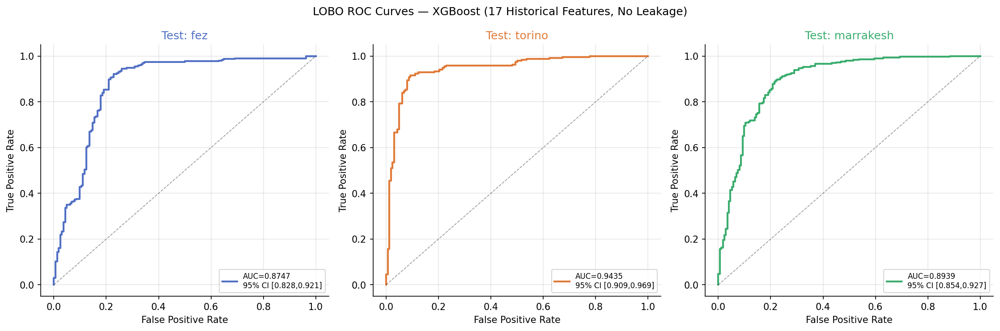
</p>

Bootstrap confidence intervals were also calculated at the qubit level to examine the stability of the results.

<p align="center">
  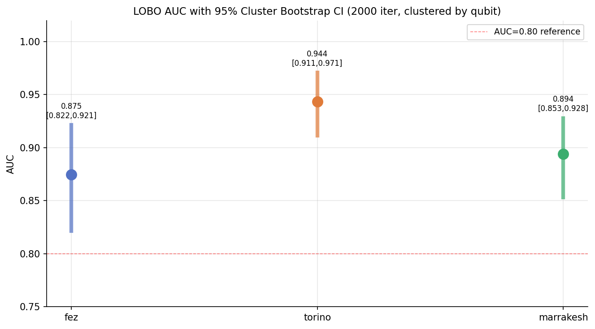
</p>

---

## 6. Future-Date Validation

Cross-backend performance alone was not enough — a model could perform well on another processor but still fail when the *same* processor changes over time. A future-date holdout was therefore performed.

- **Training window:** December 28, 2025 → January 02, 2026
- **Holdout day:** January 03, 2026 (never seen during training)

| Backend         |        AUC | Balanced Accuracy |
| --------------- | ---------: | -----------------: |
| `ibm_fez`       |     0.8292 |              0.7602 |
| `ibm_torino`    |     0.9159 |              0.8699 |
| `ibm_marrakesh` |     0.8487 |              0.7890 |
| **Mean**        | **0.8646** |          **0.8060** |

This provided evidence that historical calibration information retained predictive value on a genuinely later calibration session.

---

## 7. From Historical Data to Live Collection

The project then moved from a static dataset toward a continuously updated system. Fresh calibration information is collected from IBM Quantum and stored for subsequent analysis.

```
IBM Quantum
     ↓
Calibration collection
     ↓
Persistent storage
     ↓
Historical feature generation
     ↓
Machine-learning prediction
     ↓
Qubit ranking
     ↓
Dashboard
```

**Live platform:** https://qubit-telemetry.streamlit.app/

The deployment made it possible to observe how predictions behave on changing hardware, rather than relying only on the original historical dataset.

---

## 8. How Much History Should a Model Use?

Once live data was available, another question became important. Quantum hardware changes with time, so:

> **Is more historical data always better?**

Three temporal approaches were developed and compared:

| Model       | Training history        |
| ----------- | ------------------------ |
| Model A     | Historical baseline      |
| **Model B** | **Recent 7-day window**  |
| Model C     | Recent 30-day window     |

The goal was to determine whether recent calibration behaviour provides a better representation of near-term hardware quality than a much longer historical window.

---

## 9. The 7-Day Model Emerges as the Strongest Candidate

### Mean LOBO performance

| Model       | Window     | Mean LOBO AUC |
| ----------- | ---------- | -------------: |
| **Model B** | **7 days** |     **0.8853** |
| Model C     | 30 days    |         0.8838 |

### Prospective comparison

| Model      |        AUC | Balanced Accuracy |        MCC |
| ---------- | ---------: | -----------------: | ---------: |
| Historical |     0.8506 |              0.7518 |     0.5375 |
| **7-Day**  | **0.8957** |          **0.8015** | **0.6375** |

<p align="center">
  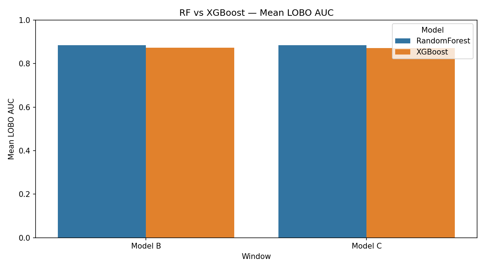
</p>

<p align="center">
  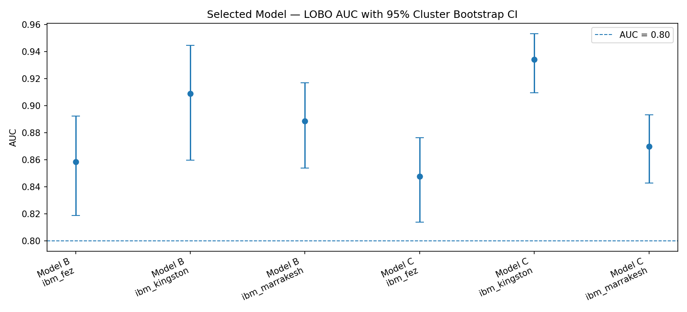
</p>

<p align="center">
  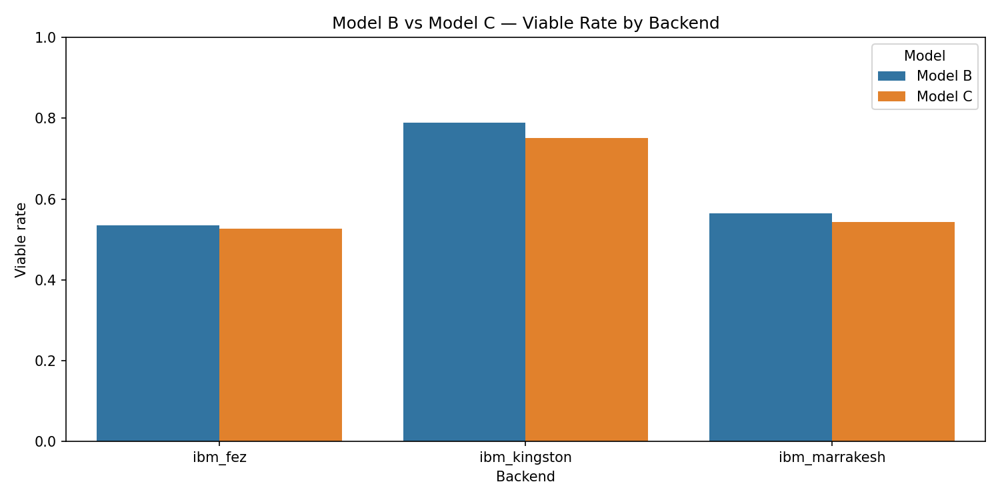
</p>

The 7-day model became the main candidate for physical hardware validation.

---

## 10. What Does the Model Actually Learn?

SHAP-based analysis was used to understand which historical measurements contributed most strongly to the predictions.

<p align="center">
  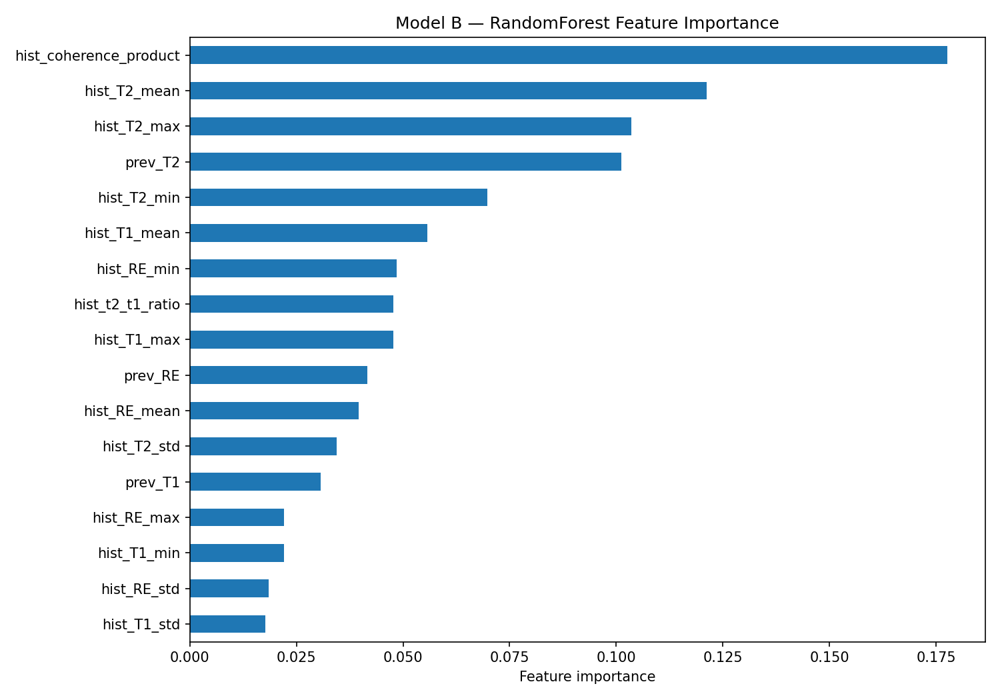
</p>

<p align="center">
  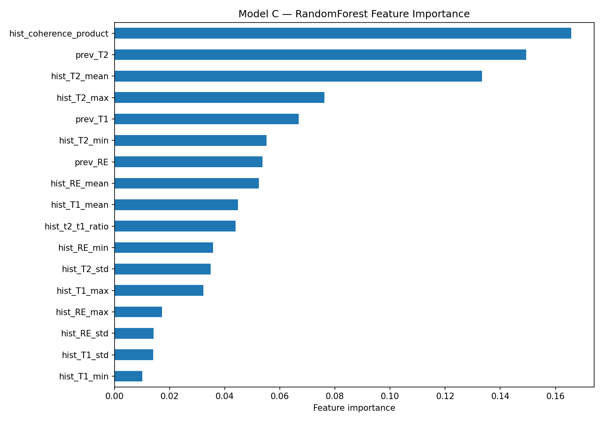
</p>

<p align="center">
  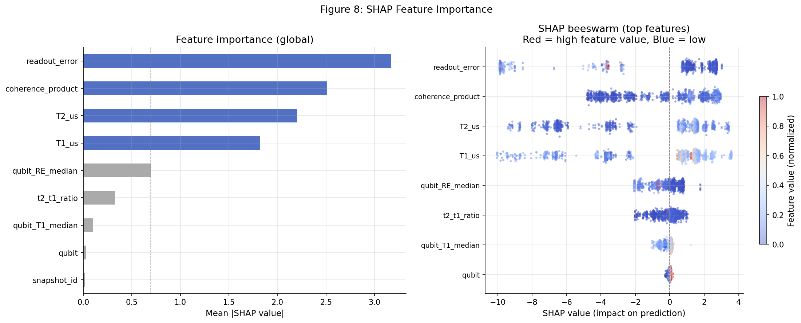
</p>

<p align="center">
  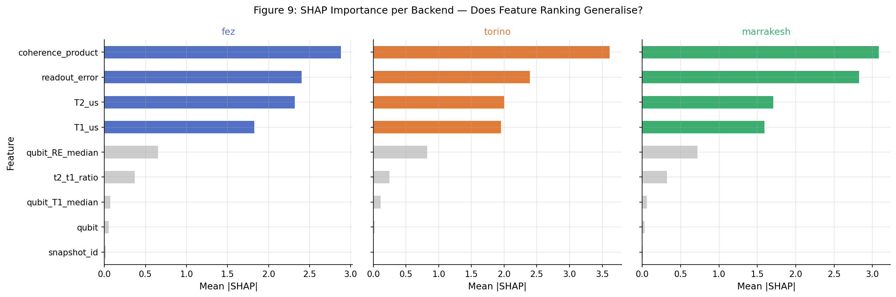
</p>

Historical coherence-related features and readout characteristics were among the most important predictive signals. These should be interpreted as **statistical model associations**, not as proof that the model has discovered a physical law.

---

## 11. Moving From Prediction to Hardware

At this point the project had demonstrated a complete offline pipeline:

```
Historical data
      ↓
Machine learning
      ↓
Cross-backend testing
      ↓
Future-date testing
      ↓
Live deployment
      ↓
Temporal model comparison
```

But one important question remained:

> **Does a model-selected group of physical qubits actually perform well when a quantum circuit is executed on real hardware?**

This required leaving the purely classical evaluation environment. Predicted qubits were selected from IBM Quantum processors and tested on real quantum hardware, comparing:

```
Model-selected qubits
        VS
Randomly selected valid qubits
```

The comparison was performed across multiple IBM Quantum backends.

---

## 12. Real IBM Quantum Hardware Experiment

The final hardware experiment evaluated all three models — **A (Historical)**, **B (7-day)**, and **C (30-day)** — against topology-valid random controls.

**Tested backends:** `ibm_fez`, `ibm_marrakesh`, `ibm_kingston`

Each experiment used a three-qubit GHZ circuit and measured the resulting output fidelity. The experiment was executed through IBM Quantum Runtime primitives on **real QPU hardware** — no simulator was used for the final hardware measurements.

---

## 13. Hardware Results

### Model-selected qubits (output fidelity)

| Backend         | Model A |    Model B | Model C |
| --------------- | ------: | ---------: | ------: |
| `ibm_fez`       |  0.9570 | **0.9727** |  0.9492 |
| `ibm_marrakesh` |  0.9609 | **0.9688** |  0.9531 |
| `ibm_kingston`  |  0.9258 | **0.9805** |  0.9688 |

**The 7-day model (Model B) produced the highest observed model-selected fidelity on all three tested backends.**

---

## 14. Random Hardware Controls

The experiment did not rely only on model-selected qubits. Topology-valid random controls were also executed on the same hardware, providing a practical baseline for whether model-selected qubits behaved differently from randomly selected, physically valid qubits.

```
Calibration history
        ↓
Machine-learning prediction
        ↓
Physical qubit selection
        ↓
Real quantum circuit
        ↓
Measured hardware fidelity
        ↓
Comparison with random controls
```

This is the point where the project moves beyond an offline ML benchmark and onto real hardware.

---

## 15. What the Hardware Experiment Does — and Does Not — Prove

The hardware results are encouraging: the 7-day model was the strongest of the three model-selection strategies in the observed hardware trials. However, this experiment is a **hardware pilot**, not a statistically powered claim of universal superiority — there is only a limited number of hardware observations for each model/backend combination.

> **The hardware pilot provides preliminary evidence that model-selected qubits — particularly those selected by the 7-day model — can produce high-fidelity circuit execution on real IBM Quantum hardware.**

A larger, repeated hardware study would be required to establish a statistically robust advantage over random selection.

---

## 16. The Research Journey

```
Real IBM Quantum calibration data
              ↓
Initial ML model
              ↓
AUC = 0.9993
              ↓
Methodological audit
              ↓
Pseudoreplication discovered
              ↓
Temporal leakage addressed
              ↓
Leak-proof modelling pipeline
              ↓
Leave-One-Backend-Out evaluation
              ↓
Future-date validation
              ↓
Live calibration collection
              ↓
Historical vs 7-day vs 30-day models
              ↓
7-day model emerges as strongest candidate
              ↓
Qubit selection
              ↓
Real IBM Quantum hardware
              ↓
Model-selected vs random controls
              ↓
Hardware fidelity measurements
```

The most important result is not a single AUC value. The project demonstrates an end-to-end research process:

**question → data → failure → audit → corrected methodology → validation → deployment → hardware experiment.**

---

## 17. Results at a Glance

| Experiment                                 |                                                 Result |
| ------------------------------------------- | -------------------------------------------------------: |
| Initial model                               | AUC **0.9993** — rejected after methodological audit    |
| Corrected LOBO model                        |                                    Mean AUC **0.9040**   |
| Future-date holdout                         |                                    Mean AUC **0.8646**   |
| 7-day temporal model                        |                               Mean LOBO AUC **0.8853**   |
| 7-day prospective evaluation                |                                         AUC **0.8957**   |
| Real hardware validation                    |                        Completed across 3 IBM backends  |
| Strongest temporal model in hardware pilot  |                                    **Model B — 7-day**   |
| Hardware execution                          |                              **Real IBM Quantum QPUs**   |

---

## 18. Visual Results

### Historical calibration behaviour

<p align="center">
  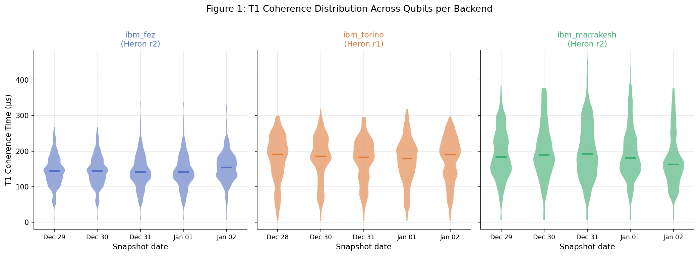
</p>

<p align="center">
  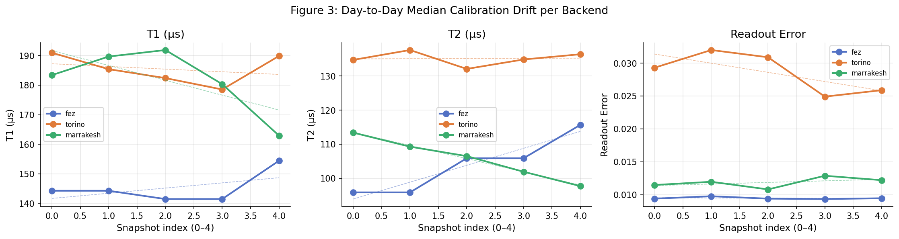
</p>

<p align="center">
  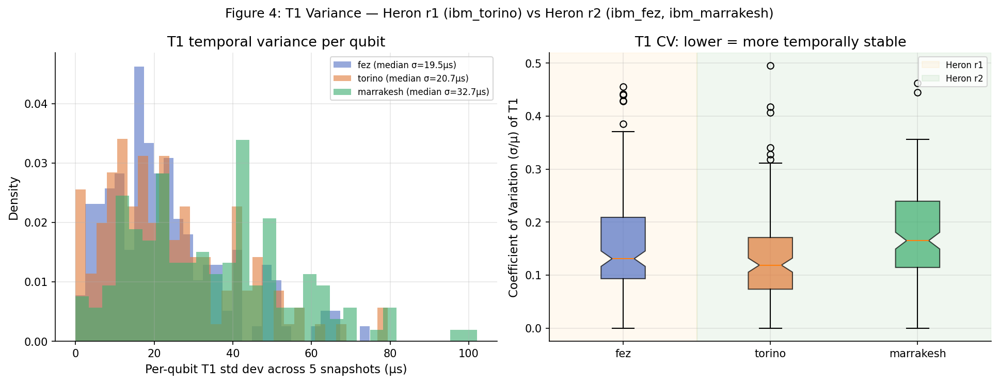
</p>

### Calibration relationships

<p align="center">
  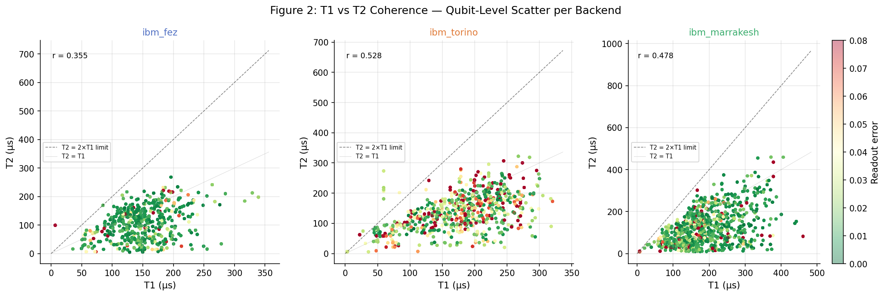
</p>

<p align="center">
  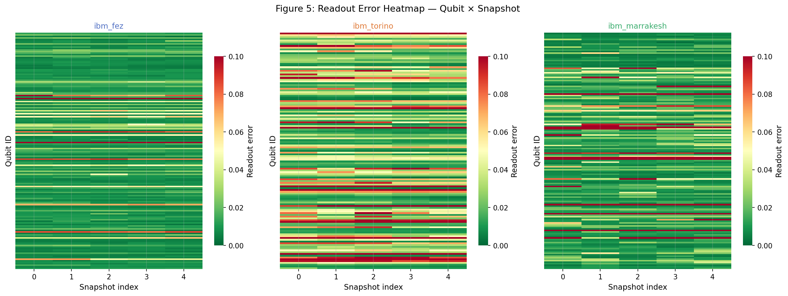
</p>

<p align="center">
  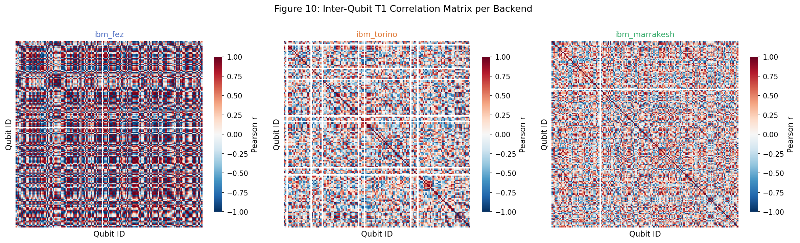
</p>

### Label distribution & baseline performance

<p align="center">
  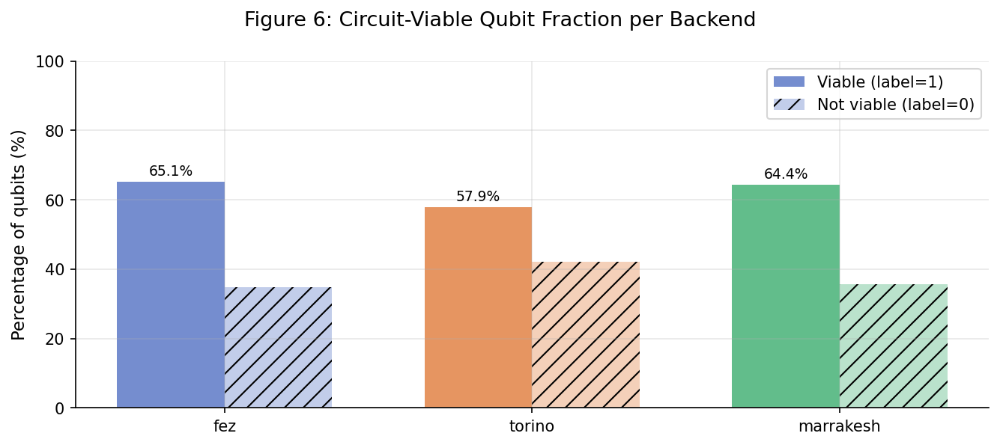
</p>

<p align="center">
  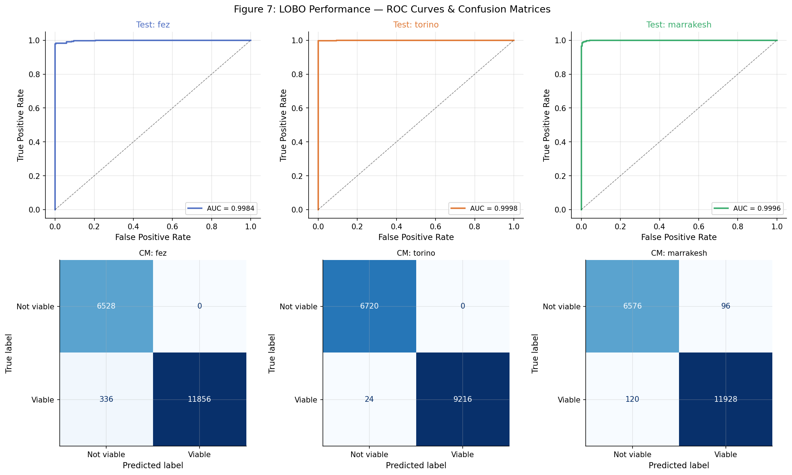
</p>

### Model explainability

<p align="center">
  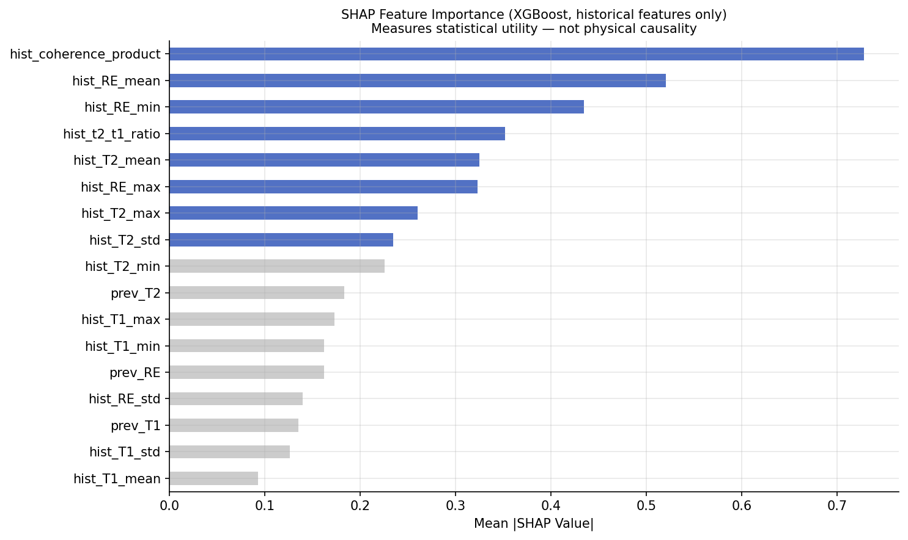
</p>

### Temporal model evaluation

<p align="center">
  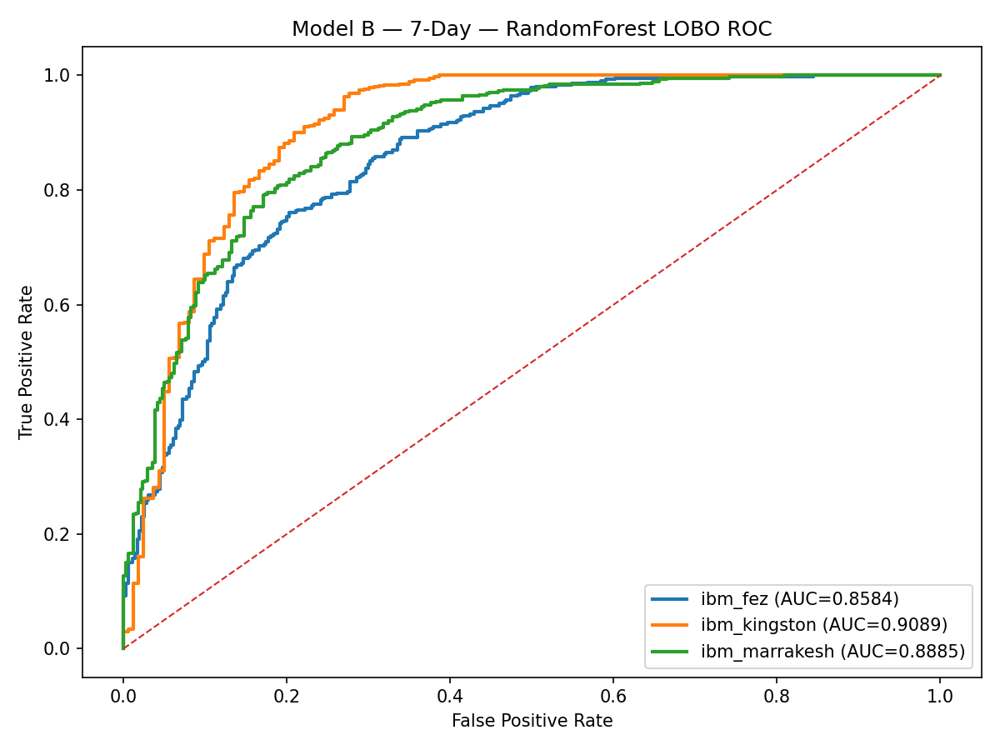
</p>

<p align="center">
  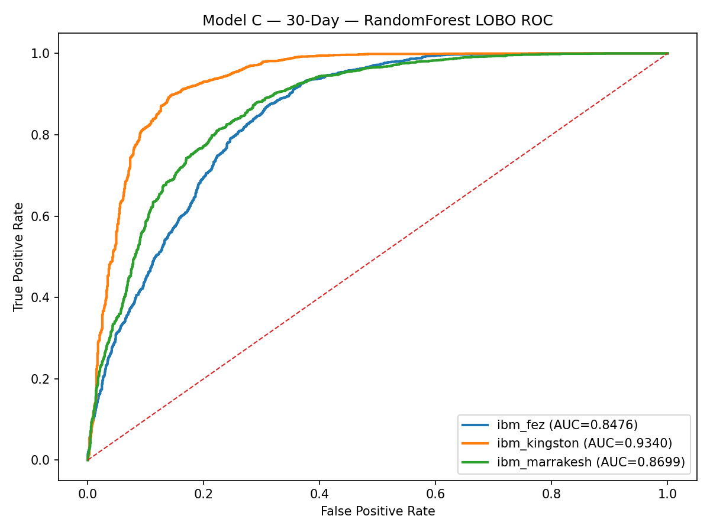
</p>

---

## 19. Repository Structure

```text
ibm-quantum-calibration-ml/
│
├── .devcontainer/
│   └── devcontainer.json
│
├── .github/
│   └── workflows/
│       └── collect.yml
│
├── .streamlit/
│   └── secrets.toml.example
│
├── data/
│   ├── .gitkeep
│   └── models/
│       ├── feature_list.json
│       └── label_thresholds.json
│
├── figures/
│   ├── fig1_T1_distribution.png
│   ├── fig2_T1_T2_scatter.png
│   ├── fig3_drift.png
│   ├── fig4_T1_variance.png
│   ├── fig5_readout_heatmap.png
│   ├── fig6_label_distribution.png
│   ├── fig7_roc_cm.png
│   ├── fig8_shap.png
│   ├── fig9_shap_per_backend.png
│   ├── fig10_qubit_correlation.png
│   ├── fig_bootstrap_ci.png
│   ├── fig_roc_lobo.png
│   ├── fig_shap.png
│   ├── model_b_c_algorithm_comparison.png
│   ├── model_b_c_bootstrap_ci.png
│   ├── model_b_c_data_balance.png
│   ├── model_b_feature_importance.png
│   ├── model_b_selected_lobo_roc.png
│   ├── model_c_feature_importance.png
│   └── model_c_selected_lobo_roc.png
│
├── models/
│   ├── .gitkeep
│   ├── feature_list.json
│   ├── label_thresholds.json
│   ├── model_b_7day.pkl
│   ├── model_c_30day.pkl
│   ├── model_metadata.json
│   └── qubit_model_v2.pkl
│
├── notebooks/
│   ├── 01_exploratory_analysis.ipynb
│   ├── 01_model_b_7day_train_test.ipynb
│   ├── 02_final_model.ipynb
│   ├── 02_model_c_30_observed_dates_train.ipynb
│   └── train_models_B_C_RF_XGB_LOBO.ipynb
│
├── results/
│   ├── model_b_7day_metadata.json
│   ├── model_c_30day_metadata.json
│   └── model_evaluation_report.json
│
├── collector.py
├── dashboard.py
├── database.py
├── evaluator.py
├── requirements.txt
├── .gitignore
├── LICENSE
└── README.md
```

---

## 20. Reproducing the Study

Clone the repository:

```bash
git clone https://github.com/Udaykiran1111/ibm-quantum-calibration-ml.git
cd ibm-quantum-calibration-ml
```

Install dependencies:

```bash
pip install -r requirements.txt
```

The main research notebooks are located in `notebooks/`:

| Notebook | Purpose |
| --- | --- |
| `01_exploratory_analysis.ipynb` | Initial exploration of raw calibration data |
| `02_final_model.ipynb` | The corrected, leak-proof historical model |
| `01_model_b_7day_train_test.ipynb` | The 7-day temporal model |
| `02_model_c_30_observed_dates_train.ipynb` | The 30-day temporal model |
| `train_models_B_C_RF_XGB_LOBO.ipynb` | Combined Model B vs Model C comparison under LOBO |

Trained model artifacts are stored in `models/`, and evaluation outputs are stored in `results/`.

> IBM Quantum credentials are intentionally excluded from the repository. Copy `.streamlit/secrets.toml.example` to `.streamlit/secrets.toml` and add your own IBM Quantum API token before running the collector or dashboard.

---

## 21. Research Blog

The README above provides the research overview. The detailed experimental journey will be documented separately, including:

- how the original 0.9993 AUC was discovered
- how pseudoreplication was identified
- how the leakage problem was investigated
- how the LOBO methodology was redesigned
- how the future-date experiment was performed
- how live IBM Quantum collection was built
- how the 7-day and 30-day models were developed
- how qubits were selected for hardware testing
- how the random hardware controls were constructed
- how the real IBM Quantum experiments were executed
- what the hardware results showed
- what limitations remain

**Detailed research blog: [Qubit Telemetry](https://medium.com/@vattikutuudaykiran/qubit-telemetry-what-a-0-9993-auc-taught-me-about-quantum-hardware-6487cc342fb1)**

---

## 22. Live Deployment

The research pipeline has also been deployed as a live application:

### QubitTelemetry
**https://qubit-telemetry.streamlit.app/**

The application presents the evolving calibration data and ML-based qubit predictions through a web interface, forming a practical bridge between the research pipeline and continuously changing quantum hardware.

---

## 23. Research Status

This project is being developed as an independent research study at the intersection of **Quantum Computing, Machine Learning, Quantum Hardware Calibration, Temporal Modelling, and Cross-Backend Generalization.**

The work has progressed from offline calibration analysis to live prediction and real IBM Quantum hardware validation. The hardware experiment is considered a pilot study; further repeated hardware trials would be required for a statistically powered comparison.

---

## Author

**Vattikuti Uday Kiran**
B.Tech Computer Science & Engineering, Lovely Professional University, India

- GitHub: [github.com/Udaykiran1111](https://github.com/Udaykiran1111)
- LinkedIn: [linkedin.com/in/uday-kiran-vattikuti](https://linkedin.com/in/uday-kiran-vattikuti)
- Mail: [Gmail](mailto:vattikutuudaykiran@gmail.com)


---

## License

MIT License
